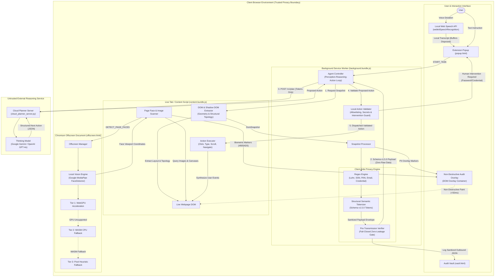

# System Architecture & Privacy Boundary

This document describes the architectural design, trust boundaries, and execution pipeline of the **Browser Agent Prototype** in accordance with **Constitution v1.5.0**.

---

## 1. High-Level Architecture Diagram

---

## 2. Architectural Components

### A. Client-Side Privacy Boundary
1. **Zero Raw Data Transmission (Article I)**: Raw pixel buffers, base64 image streams, and plaintext user secrets never leave the client browser.
2. **Structural Semantic Tokenization (Article III)**: Sensitive text values are replaced with strict semantic placeholder tokens (`<REDACTED_FINANCIAL>`, `<REDACTED_IDENTITY>`, `<REDACTED_CREDENTIAL>`, `<REDACTED_CONTACT>`, `<REDACTED_BIOMETRIC_VISUAL>`).
3. **Pre-Transmission Verifier (Article V)**: Operates fail-closed. If unmasked PII, schema mismatches, or binary image buffers leak into the outbound payload, the network dispatch halts immediately.

### B. Local Vision & Face Redaction (Article II & X)
1. **Isolated Offscreen Context (Article IV)**: Visual neural inference executes in an isolated Chromium Offscreen Document (`offscreen.html`).
2. **Two-Tier Inference with Fallback**:
   - **Tier 1 (Primary)**: Hardware-accelerated WebGPU inference via Google MediaPipe `FaceDetector`.
   - **Tier 2 (Fallback)**: CPU WebAssembly (WASM/XNNPACK) inference.
   - **Tier 3 (Heuristic)**: In-memory pixel heuristic to guarantee zero unmasked faces even in headless or virtual GPU environments.
3. **Audit Overlay (Article IX)**: Detected faces receive non-destructive purple bounding boxes (`#805AD5`) rendered under a strict `<50ms` paint budget.

### C. Voice Input Privacy (Article XII)
- Natural language voice instructions are captured via the browser's native Web Speech API (`webkitSpeechRecognition`).
- Raw audio streams are never recorded or transmitted off-device; audio buffers are disposed immediately upon final transcription.

### D. Perception-Reasoning-Action Loop (Article XIV & XV)
1. **Observe**: DOM topology and layout geometry are non-destructively extracted without mutating the live webpage.
2. **Detect & Sanitize**: Regex pattern matching and local neural models locate PII and faces.
3. **Verify**: Pre-transmission verification validates payload integrity.
4. **Transmit & Reason**: The Cloud Planner Server receives only sanitized Schema v1.5.0 payloads and prompts the thinking model (e.g. Gemini / GPT-4o).
5. **Validate**: The agent validates proposed actions against an allowlist (`click`, `type`, `scroll`, `navigate`) and pauses for human intervention on password/credential fields (Article XIII).
6. **Execute**: Validated actions are safely dispatched to the live DOM with visual feedback.
